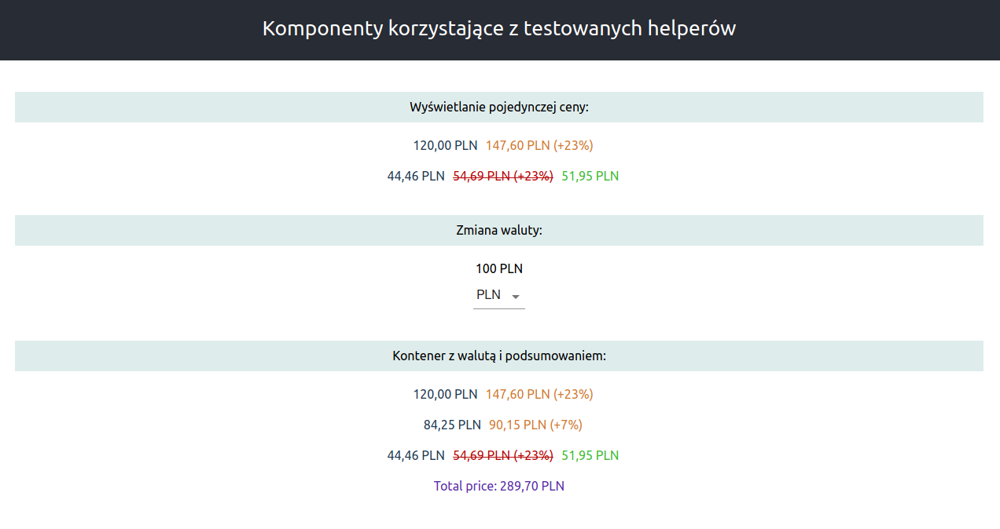

# Testowanie aplikacji React za pomocą JEST

JEST jest prostym w użyciu frameworkiem stworzonym do testowania JavaScript

## Instalacja i odpalanie

Po sklonowaniu repozytorium [jesttesting](https://github.com/WojPpl/jesttesting) należy wykonać w katalogu projektu następujące polecenia:

```bash
npm install
```
Zostaną zainstalowane moduły zależności zawarte w pliku package.json

```bash
npm start
```
Odpali aplikację React (adres przeglądarki [http://localhost:3000/](http://localhost:3000/) )

```bash
npm test
```
Odpali testy JEST w terminalu

## Aplikacja
_( W przykładach wykorzystano komponenty [Material UI](http://localhost:3000/) )_

Odpal aplikację poleceniem npm start żeby zobaczyć jakie ma funkcjonalności



Aplikacja ma kilka funkcjonalności przede wszystkim wyświetlanie ceny brutto i ceny z obniżką.
Obydwie funkcjonalności korzystają z zawartych w drzewie helperów (src/helpers) i do nich właśnie są napisane przykładowe testy
(src/helpers/tests). Ponieważ przykład dotyczy testów JEST nie jest konieczne oglądanie kodu komponentów - można jednak zobaczyć
jakie parametry otrzymują i co wyprowadzają helpery calculateSpecialPrice i priceWithTax

## Testy renderu
W aplikacjach reactowych zawarty jest domyślnie przykładowy test (App.test.js)
```javascript
import { render, screen } from '@testing-library/react';
import App from './App';

test('renders info test', () => {
    render(<App />);
    const infoElement = screen.getByText(/Komponenty korzystające z testowanych helperów/i);
    expect(infoElement).toBeInTheDocument();
});
```
Test ten pobiera główny komponent aplikacji <App />, renderuje go do html a następnie szuka zawartego w nim tekstu.
Następnie oczekuje że dokument zawiera ten tekst `expect(infoElement).toBeInTheDocument();`
Słowo expect jest w naszych testach kluczowe. Zawsze wykonując test będziemy oczekiwać jakiegoś wyniku (czyli korzystać z expect)

Odpal test indywidualnie z terminala

```bash
npm test App.test.js
```

Otrzymasz informację o prawidłowym wykonaniu testu wraz z czasem jego wykonania i zadanym opisem.


Zmień tekst w metodzie `getByText` żeby sprawdzić prawdziwość działania expect

Testy renderu są wykonywane znacznie rzadziej niż testy funkcji przetważających dane. Z prostego powodu. 
Czy dany element się wyświetla i czy działa prawidłowo wizualnie widać po prostu po odpaleniu aplikacji.

## Test prawidłowości działania funkcji

W repozytorium mamy zawarte dwa przykładowe testy sprawdzające metody wyliczające cenę brutto i cenę promocyjną

Zwróć uwagę na ich kod

####plik: calculateSpecial.test.js
```javascript
import calculateSpecialPrice from "../calculateSpecialPrice"

const mockPrice = {
    basePrice: 44.46,
    tax: 23,
    discount: 5
}
describe("Calculate special price", () => {
    it("shows good spacial price with coma", () => {
        expect(calculateSpecialPrice(mockPrice.basePrice,mockPrice.tax,mockPrice.discount)).toEqual("51,95");
    });
    it("contains dot instead of coma", () => {
        expect(calculateSpecialPrice(mockPrice.basePrice,mockPrice.tax,mockPrice.discount,false)).toContain(".");
    });
});
```
W pierwszej linijce importujemy funkcję którą chcemy przetestować. Funkcja przyjmuje parametry:
cena bazowa, podatek(procent wyrażony liczbą całkowitą) i obniżke (procent liczbą całkowitą), 
ostatni parametr decyduje czy liczba ma się wyświelać z przecinkiem (domyślnie true)

Do testu potrzebne nam będą dane testowe, W przypadku tego testu zawarte są one bezpośrednio
w pliku w obiekcie mockPrice

Dalsze linijki są już właściwą częścią testu

`describe` po którym następuje opis zestawu testów zamyka nam testy w zestawie

`it` po którym następuje opis testu zamyka nam pojedyńczy test

`expect` test właśiwy jako parametr otrzymuje testowaną funkcję. 

Expect występuje zawsze z metodą porównawczą

W przypadku pierwszego testu jest to `toEqual` sprawdzamy czy wynik funkcji z podanymi danymi równy jest
**"51,95"** (funkcja zwraca string).

W przypadku drugiego testu jest to `toContain`. Metoda sprawdza czy zwracany przez funkcję ciag zawiera wskazane znaki
Test wykona się prawidłowo ponieważ w ostanim parametrze do funkcji przekazaliśmy false - czyli liczba
nie zostanie wyprowadzona z domyślnym przecinkiem

Pełna lista metod porównawczych dostępna jest w dokumentacji [JEST](https://jestjs.io/docs/en/expect.html)

####plik: calculateSpecial.test.js
```javascript
import priceWithTax from "../priceWithTax"
import prices from "../../mockData/prices";

describe("Price with tax", () => {
    it("shows good final price with coma", () => {
        expect(priceWithTax(prices[0].basePrice, prices[0].tax)).toEqual("147,60");
    });

    it("shows good final price without coma", () => {
        expect(priceWithTax(prices[2].basePrice, prices[2].tax, false)).toEqual("54.69");
    });

});
```

W powyższym zestawie testów występuje tylko jedna metoda porównawcza `toEqual`

Zwróć uwagę że dane do testów są załączane z pliku zewnętrznego.

Ostatnim parametrem funkcji priceWithTax jest również parametr determinujący to czy cena
jest wyświetlana z przecinkiem czy kropką.

Metody porównawcze zależą często od doboru testującego. Te same funkcjonalności można
często przetestować różnymi metodami

Odpal testy.
Przy odpaleniu testów w terminalu opisy po describe i it umożliwiają ich łatwiejsze ich rozpoznanie


## Przetestuj samodzielnie

Dodaj w katalogu src/helpers plik z rozszerzeniem .test.js i zaimportuj do niego funkcję exchangeCurrency
Nie zapomnij dodać mockowych danych wewnątrz pliku lub z zewnątrz z katalogu mockData
Napisz testy sprawdzające prawidłowość przeliczania walut

## Licencja
[MIT](https://choosealicense.com/licenses/mit/)